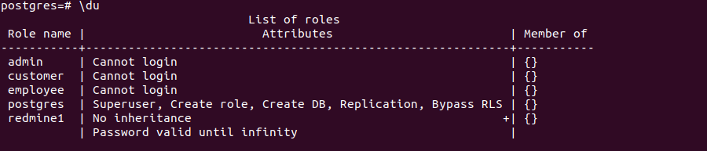
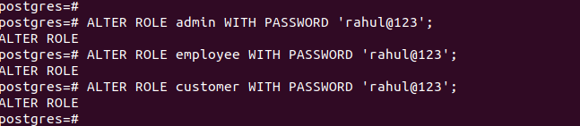
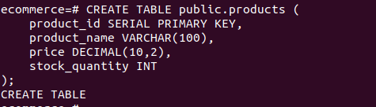
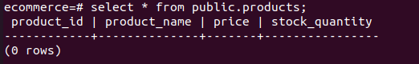
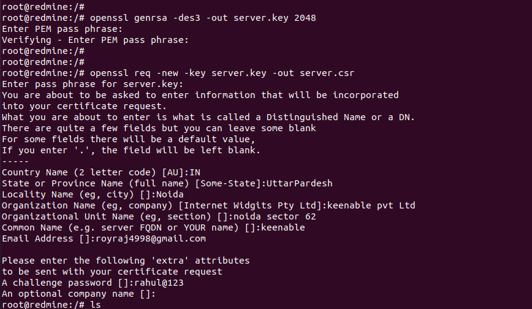
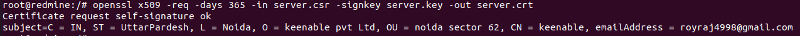
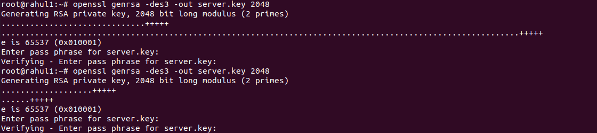
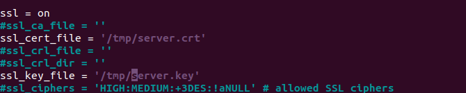
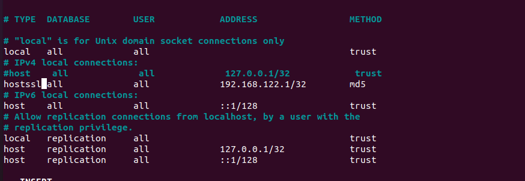

### 1. Create Roles:
#### 1.1. Create three roles: admin, employee, and customer. Use the CREATE


#### ROLE statement.
```
CREATE ROLE admin;
CREATE ROLE employee;
CREATE ROLE customer;
```


#### Now, let's check the list of role.

```
keenable=# \du
``` 



#### 1.2. Assign a password to each role.
```
ALTER ROLE admin WITH PASSWORD 'rahul@123';
ALTER ROLE employee WITH PASSWORD 'rahul@123';
ALTER ROLE customer WITH PASSWORD 'rahul@123';
```



 
#### 2. Grant Privileges:
##### 2.1. Create a database named ecommerce.
```
CREATE DATABASE ecommerce;
```


 

#### 2.2. Assign the following privileges:
##### 2.2.1. The admin role should have full access to the ecommerce database.

 <!--  -->
```
GRANT ALL PRIVILEGES ON DATABASE ecommerce TO admin;
```
##### Now, connect to ecommerce database.

```
\c ecommerce 
You are now connected to database "ecommerce" as user "rahul".

```


##### 2.2.2. The employee role should have read and write access to the products table in the ecommerce database.

#### firstly crete product table.

```
CREATE TABLE products (
    product_id SERIAL PRIMARY KEY,
    product_name VARCHAR(100),
    price DECIMAL(10,2),
    stock INT
);

```


#### Now, let'c check the product table
```
 \dt
```


### Now, give the permssion for read and write on products tables.

```GRANT SELECT, INSERT, UPDATE, DELETE ON products TO employee;
GRANT
```


#### 2.2.3. The customer role should have read-only access to the products table.
```
GRANT SELECT ON products TO customer;
```


### 4. Table and Schema Creation:
#### 4.1. Create a schema named product.

```
CREATE SCHEMA product;
```


#### Now, check the list of schema.
```
\dn 
```


#### 4.2. Create a table named products in the public schema with columns such as product_id, product_name, price, and stock_quantity.	

```
CREATE TABLE public.products (
    product_id SERIAL PRIMARY KEY,
    product_name VARCHAR(100),
    price DECIMAL(10,2),
    stock_quantity INT
);
```


#### Now, let's check the details of product table.
```
\dt public.products 
 ```


#### Now, let's check the details of product table inside the public squema.
```
select * from public.products;
```


### 5. Generate Self-Signed Certificates:
#### 5.1. Generate self-signed SSL certificates for the PostgreSQL server. You can use the openssl command or an SSL certificate generation tool.

```
openssl genrsa -des3 -out server.key 2048

openssl req -new -key server.key -out server.csr
```


```
openssl x509 -req -days 365 -in server.csr -signkey 
```

```
server.key -out server.crt

openssl rsa -in server.key -out server.key
```



### 6. Configure PostgreSQL:
#### 6.1. Edit the PostgreSQL configuration file (usually postgresql.conf) to enable TLS and specify the paths to the SSL certificates you generated.

##### postgresql.conf
``` 
ssl = on
ssl_cert_file = '/path/to/ssl_directory/server.crt'
ssl_key_file = '/path/to/ssl_directory/server.key'
```



### 7. Configure pg_hba.conf:
#### 7.1. Edit the pg_hba.conf file to define access rules for TLS connections. Allow TLS connections from specific IP addresses or users (customer).

##### Add Access Rules for TLS Connections:
```
hostssl    all             customer        192.168.122.1/32        md5

```



### 8. Testing:

#### 8.1. Test the setup by connecting to the ecommerce database using the roles you've created.

```
podman exec -it postgres1 psql -h 127.0.0.0 psql -U admin -d ecommerce

```


#### 8.2. Ensure that admin can perform any action, employee can insert and update products, and customer can only read products.

#### Create table name demo.

```
CREATE TABLE demo (
    id serial PRIMARY KEY, 
    name varchar(100) NOT NULL
);

```
#### Insert data into the demo table.

```
INSERT INTO demo (id, name) VALUES (1001, 'Rahul');

```
#### Update data into the name column of demo table.

```
UPDATE demo SET name = 'Ankur' WHERE id = 1;

```
#### Now, Delete the demo table.

```
DROP TABLE demo ;

```

### Now, login with Employee Role:

```
podman exec -it postgres1 psql -h 127.0.0.0 -U employee -d ecommerce

```
#### Now, Insert data into the ecommerc datatabse within the prodect tables.

```
INSERT INTO products (product_name, price, stock_quantity) VALUES ('Book', 5.00, 1000);

```

#### Now, update the producte table 
```

UPDATE products SET price = 12.00 WHERE product_id = 1;

```


#### Now, login with Customer Role: 

```
podman exec -it postgres1 psql -h 127.0.0.0 -U customer -d ecommerce

``` 

#### Now, Insert the data from Customer role(permission deney)

``` 

INSERT INTO products (product_name, price, stock_quantity) VALUES ('Pen', 6.00, 50);

``` 

#### 8.3. Verify that host-based authentication rules are enforced.

``` 
podman exec -it postgres1 psql -h 192.168.122.1 -U admin -d ecommerce

``` 

#### 8.4. Attempt to connect to the PostgreSQL server from a user customer, specifying the use of SSL. Make sure SSL connection is established 

``` 
psql "sslmode=require host=192.168.122.1 dbname=ecommerce user=customer

``` 
